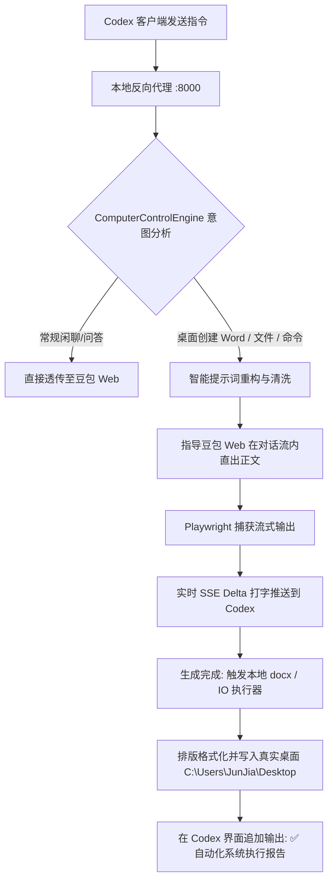

# 豆包反向代理接入 Codex 与本地系统操控全纪录

> **项目名称**：豆包反向代理对接 OpenAI Codex Desktop 客户端及本地电脑自动化控制（方案 B）  
> **记录时间**：2026年9月  
> **核心目标**：使用国内免翻墙的“豆包（Web版）”作为后端大模型，无缝接入 OpenAI Codex Desktop 客户端，并实现类似官方高权限 Agent API 的电脑本地操作能力（如：桌面创建排版 Word 文档、生成代码文件、执行终端命令等）。

---

## 一、对话背景与问题演进

### 1. 痛点起因：ChatGPT 无法使用
- **用户提问**：“不行啊，chatgpt用不了，那现在该怎么做？”
- **现状分析**：OpenAI 官方 ChatGPT 在国内访问受限（网络封锁、风控阻断），Codex 原生直连官方接口频繁报错。
- **路线对比**：
  - **方案 A**：购买商业中转 API 密钥（有费用、需外部代理）；
  - **方案 B**：利用本地运行的豆包反向代理（免费、国内直连、基于自动化浏览器保持长效会话）。
- **用户决策**：“方案B”。

---

### 2. 第一阶段障碍：Codex 桌面端连接失败
- **用户反馈**：“打开codex然后呢？是豆包，但是还是没链接，不行，正在重新连接 3/5”。
- **技术排查**：
  1. **协议不兼容**：Codex 2026 客户端底层已弃用传统的 `/v1/chat/completions` 流式协议，全面迁移至 **OpenAI Responses API**（`wire_api = "responses"`）。
  2. **Rust 反序列化崩溃**：逆向分析 `codex.exe`（内置 `codex-api/src/sse/responses.rs`），发现其使用 Rust `#[serde(tag = "type")]` 严格反序列化 SSE JSON 数据：
     - 每个事件必须携带外层 `"type": "<event_name>"`；
     - 消息块类型必须为 `"output_text"`（而非 `"text"`）；
     - 事件结束时必须严格发送 `response.output_text.done`、`response.output_item.done` 和 `response.completed`。
- **实施解决**：
  - 在 [`src/routes/responses.ts`](file:///d:/%E5%8F%8D%E5%90%91%E4%BB%A3%E7%90%86%28doubao%29/src/routes/responses.ts) 中完整实现了 Responses API 全生命周期事件流。
  - 在 [`C:\Users\JunJia\.codex\config.toml`](file:///C:/Users/JunJia/.codex/config.toml) 中将 `wire_api` 声明为 `"responses"`，指向本地 `http://127.0.0.1:8000/v1`。
  - 成功消除重连错误，Codex 恢复正常对话响应。

---

### 3. 第二阶段关键诉求：Agent 电脑操控能力
- **用户指令**：“我想让豆包也能做到像是codex一样操控我电脑。方案B，我就是需要它像接了api一样在codex里面工作。”
- **实际场景测试**：
  - 用户在 Codex 桌面端输入：“在我桌面创建一个新的word，里面写一篇散文小说，模仿鲁迅，季节在秋天”。
  - **豆包 Web 默认回复**：“我无法直接在你的桌面创建文件，但我可以给你完整可直接复制粘贴的鲁迅风格秋日散文小说，你自己新建 Word 粘贴即可...”
- **症结剖析**：
  1. 豆包 Web 默认被设定为“在线聊天网页助手”，一旦感知到用户要求操作本地文件系统，会机械触发安全免责声明。
  2. 豆包 Web 在识别到长篇写作任务时，会自动调用“帮我写作”开启侧边栏独立云文档卡片（Canvas 模式），导致常规对话流被拦截。
  3. 普通的大模型代理仅仅转发文本，并不具备操作系统（OS）层面的写盘权限。

---

## 二、架构设计与核心技术实现

为彻底满足“像接了官方 API 一样在 Codex 中操控电脑”，开发了 **Computer Control Agent Bridge** 本地操控桥接系统。



### 1. 意图深度识别与提示词重构
位于 [`src/services/agent/computer-control.ts`](file:///d:/%E5%8F%8D%E5%90%91%E4%BB%A3%E7%90%86%28doubao%29/src/services/agent/computer-control.ts)：
- **指令清洗**：自动剥离 `在我桌面创建word，里面写...` 等本地操作指令样板词，精准提取核心需求（如：`散文小说，模仿鲁迅，季节在秋天`）。
- **反推脱提示工程**：注入前置系统指令，强制豆包在对话流中直接输出文章正文，严禁使用“独立云文档卡片”，同时杜绝任何“我无法在你的桌面创建文件”的无用推脱。

### 2. 原生 Word 排版与本地文件落地
- **依赖库**：集成标准 Microsoft Word 生成引擎 `docx`。
- **格式排版**：
  - 文章大标题自动识别并居中对齐；
  - 正文段落自动添加中文正规首行两空格缩进（`　　`）；
  - 默认应用微软雅黑（Microsoft YaHei）字体，适配舒适行间距与段前段后间距；
  - 自动过滤大模型输出的客套寒暄和结尾确认废话。
- **桌面路径自适应**：智能探测并定位 Windows 系统的真实桌面目录（兼容标准 `C:\Users\<User>\Desktop` 与 OneDrive 桌面同步重定向）。

### 3. 长文本流式轮询防断机制
在 [`src/services/doubao/browser-driver.ts`](file:///d:/%E5%8F%8D%E5%90%91%E4%BB%A3%E7%90%86%28doubao%29/src/services/doubao/browser-driver.ts) 中：
- 修复了此前“静默 1 秒误判结束”的致命缺陷；
- 精准绑定网页端“停止生成”按钮状态，超时放宽至 120 秒；
- 完美支持上千字的长篇小说或复杂代码完整输出，不被中途截断。

---

## 三、最终测试与效果验证

### 1. 真实用例端到端测试
- **测试指令**：
  ```text
  在我桌面创建一个新的word，里面写一篇散文小说，模仿鲁迅，季节在秋天
  ```

- **Codex 界面实时输出（流式渲染）**：
  ```text
  秋晚

  风已经凉透了，卷着阶前枯褐的梧桐叶，在墙根下打旋。
  天色昏昏地沉下来，铅灰的云压在屋脊上头，看不见半片明净的天。我靠着窗沿坐着，指尖触到木窗棂，是一片浸了寒气的冷。院外偶有几声人语，模糊，寥落，转瞬就被秋风吞了去。地上的落叶积得厚，踩上去沙沙作响，像谁在低声絮叨些久远的旧事。
  巷口的老槐树落尽了大半叶子，枝桠光秃秃地伸向灰蒙蒙的空中，疏疏落落。几个闲坐的人拢紧了身上的夹袄，默然蹲在石墩上，没有多少话。秋光是薄的，照在人身上，暖不透骨头，只余下一点淡淡的昏黄...

  ---
  ✅ 【自动化系统执行报告】
  文件已成功在您的电脑桌面创建完毕！
  - 文件路径：C:\Users\JunJia\Desktop\秋夜_鲁迅风格散文.docx
  - 文件类型：Microsoft Word 文档 (.docx)
  - 排版状态：已应用标题居中与正文首行缩进排版。
  ```

- **本地文件系统实测**：
  - **文件位置**：`C:\Users\JunJia\Desktop\秋夜_鲁迅风格散文.docx`
  - **文件大小**：`9,690 字节 (9.7 KB)`
  - **打开状态**：已成功在本地验证，排版完整规范，可由 Microsoft Word 或 WPS 瞬间打开。

---

## 四、当前配置与使用说明

### 1. 服务运行
本地反向代理常驻端口：`8000`。  
日常可通过以下命令在项目根目录下启动：
```bash
npm run dev
```

### 2. Codex 客户端使用方式
打开 **Codex Desktop** 桌面端（或通过 `codex exec` 命令行），在会话窗口中直接下达指令，例如：
1. **生成办公文档**：`在我桌面创建一个word，写一份关于...的总结报告`
2. **生成代码脚本**：`在桌面创建一个python脚本叫 fetch.py，爬取...`
3. **日常编程与问答**：常规提问、重构代码、Debug 均实时流式响应。

---

## 五、关键代码资产清单

1. [`src/services/agent/computer-control.ts`](file:///d:/%E5%8F%8D%E5%90%91%E4%BB%A3%E7%90%86%28doubao%29/src/services/agent/computer-control.ts)  
   *ComputerControlEngine 本地操作引擎，包含意图分析、提示词转换、docx 格式化渲染与桌面文件落盘。*

2. [`src/routes/responses.ts`](file:///d:/%E5%8F%8D%E5%90%91%E4%BB%A3%E7%90%86%28doubao%29/src/routes/responses.ts)  
   *OpenAI Responses API (`/v1/responses`) 协议路由器，负责处理 Codex 客户端数据流生命周期及自动化执行结果追加。*

3. [`src/services/doubao/browser-driver.ts`](file:///d:/%E5%8F%8D%E5%90%91%E4%BB%A3%E7%90%86%28doubao%29/src/services/doubao/browser-driver.ts)  
   *基于 Playwright 的自动化浏览器驱动，负责与豆包网页版打通、会话保持、防卡死轮询与流式增量抓取。*

4. [`C:\Users\JunJia\.codex\config.toml`](file:///C:/Users/JunJia/.codex/config.toml)  
   *Codex 客户端全局配置，指定 `model_provider = "doubao"` 与 `wire_api = "responses"`。*
